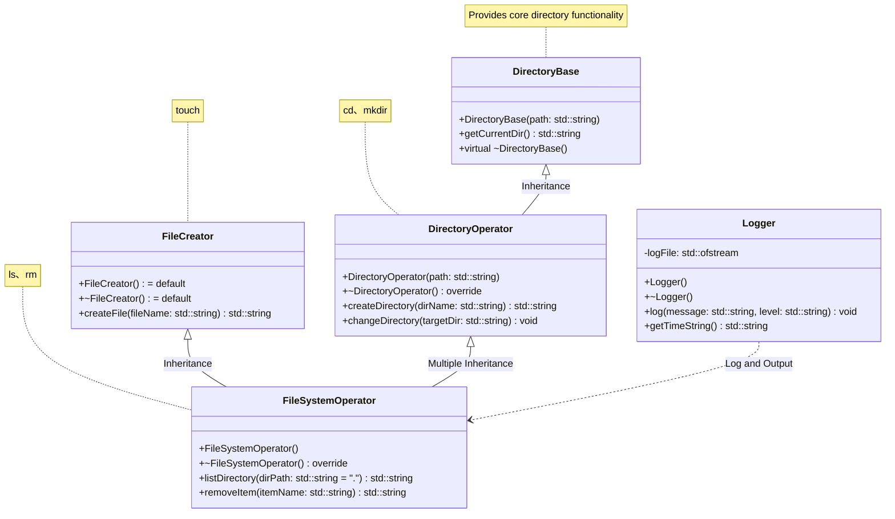

# A simple File System by C++

```mermaid
classDiagram
    %% 定义类及成员
    class Logger {
        -logFile: std::ofstream
        +Logger()
        +~Logger()
        +log(message: std::string, level: std::string) void
        +getTimeString() std::string  
    }
    
    class FileCreator {
        +FileCreator() = default
        +~FileCreator() = default
        +createFile(fileName: std::string) std::string
    }
    
    class DirectoryBase {
        +DirectoryBase(path: std::string)
        +getCurrentDir() std::string
        +virtual ~DirectoryBase()
    }
    
    class DirectoryOperator {
        +DirectoryOperator(path: std::string)
        +~DirectoryOperator() override
        +createDirectory(dirName: std::string) std::string
        +changeDirectory(targetDir: std::string) void
    }
    
    class FileSystemOperator {
        +FileSystemOperator()
        +~FileSystemOperator() override
        +listDirectory(dirPath: std::string = ".") std::string
        +removeItem(itemName: std::string) std::string
    }
    
    %% 定义继承关系
    DirectoryBase <|-- DirectoryOperator : Inheritance
    FileCreator <|-- FileSystemOperator : Inheritance
    DirectoryOperator <|-- FileSystemOperator : Multiple Inheritance
    
    %% 定义依赖关系
    Logger ..> FileSystemOperator : Log and Output
    
    %% 定义注释
    note for DirectoryBase "Provides core directory functionality"
    note for FileCreator "touch"
    note for FileSystemOperator "ls、rm"
    note for DirectoryOperator "cd、mkdir"

```

